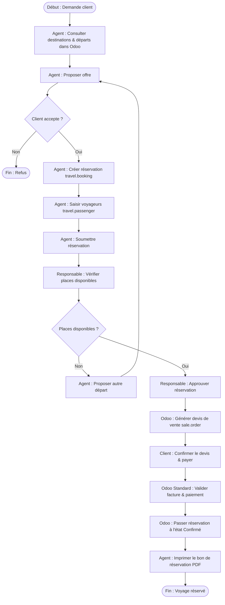
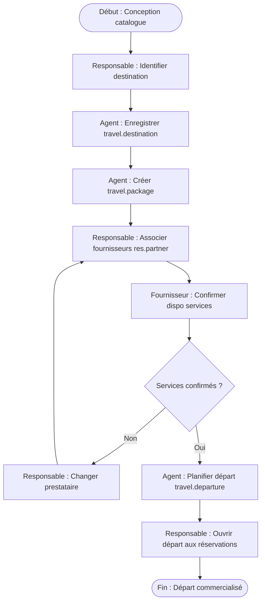
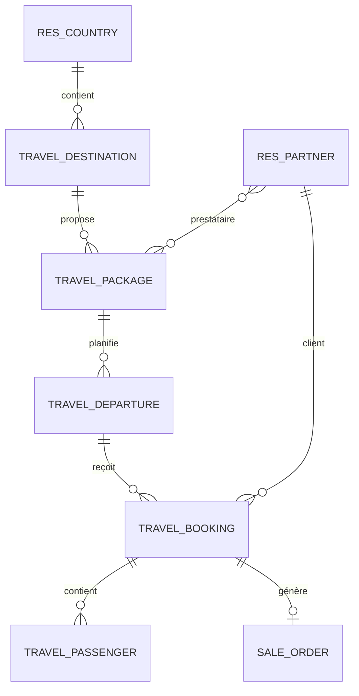

# Rapport de Projet - Examen Final Odoo 17

* **Université** : Université Mundiapolis
* **Module** : Conception de Systèmes d’Information
* **Projet** : Conception et Implémentation d’un SI sous Odoo 17
* **Sujet** : Gestion d’une agence de voyages
* **Module Odoo** : `travel_agency_management`
* **Étudiant** : Anouar Mohamed
* **Année Académique** : 2025 - 2026
* **Date** : 10 Juin 2026

---

## Table des Matières
1. [Introduction](#1-introduction)
2. [Modélisation Métier BPMN](#2-modelisation-metier-bpmn)
   - [2.1. Processus de réservation d'un voyage](#21-processus-de-reservation-dun-voyage)
   - [2.2. Processus de préparation et gestion des prestations touristiques](#22-processus-de-preparation-et-gestion-des-prestations-touristiques)
3. [Conception du Système d’Information](#3-conception-du-systeme-dinformation)
   - [3.1. Architecture fonctionnelle et intégration](#31-architecture-fonctionnelle-et-integration)
   - [3.2. Modèle de données relationnel](#32-modele-de-donnees-relationnel)
   - [3.3. Sécurité et droits d'accès](#33-securite-et-droits-dacces)
4. [Réalisation sous Odoo 17](#4-realisation-sous-odoo-17)
   - [4.1. Structure technique du module](#41-structure-technique-du-module)
   - [4.2. Logique métier (Python)](#42-logique-metier-python)
   - [4.3. Interface Utilisateur (XML)](#43-interface-utilisateur-xml)
   - [4.4. Workflow de validation](#44-workflow-de-validation)
   - [4.5. Intégration commerciale (Sale Order)](#45-integration-commerciale-sale-order)
   - [4.6. Rapport imprimable QWeb PDF](#46-rapport-imprimable-qweb-pdf)
   - [4.7. Reporting et vues analytiques](#47-reporting-et-vues-analytiques)
5. [Manuel Utilisateur](#5-manuel-utilisateur)
6. [Cahier de Recette / Tests Fonctionnels](#6-cahier-de-recette--tests-fonctionnels)
7. [Conclusion](#7-conclusion)

---

## 1. Introduction

Ce rapport présente les travaux de conception et de réalisation d'un système d'information (SI) sous Odoo 17 pour l'agence de voyages fictive **Atlas Horizon Travel**. L'activité de cette entreprise repose sur l'organisation et la commercialisation de séjours touristiques structurés sous forme de packages avec des départs programmés.

### Problématique métier
La gestion d'une agence de voyages comporte plusieurs contraintes spécifiques :
1. **Contrôle de la capacité** : Chaque départ programmé possède une limite physique de places (liée aux moyens de transport ou d'hébergement). Une vente excédentaire (surbooking) engendre des litiges commerciaux et des pénalités financières.
2. **Double saisie des données** : Le manque de centralisation nécessite la recopie des données des clients et des voyageurs depuis la réservation initiale vers les devis commerciaux, la facturation et les billets de voyage.
3. **Suivi des statuts** : La multiplicité des dossiers nécessite un suivi rigoureux des étapes de validation (de la prise de contact à la confirmation après encaissement).

### Objectifs du système d'information
Pour répondre à ces besoins, le système d'information développé doit :
* Centraliser le référentiel des destinations et des packages commerciaux.
* Automatiser le calcul des disponibilités en temps réel.
* Bloquer les réservations en cas de dépassement de la capacité autorisée.
* Lier le workflow métier aux fonctions comptables et commerciales standards d'Odoo (Ventes et Facturation).
* Fournir des vues de reporting analytiques (graphiques et tableaux croisés) pour l'aide à la décision.
* Générer les documents PDF de confirmation (Bons de réservation).

L'ERP Odoo 17 a été choisi pour son infrastructure modulaire (MVC), sa persistance de données avec PostgreSQL, et sa gestion native de la sécurité et du chatter collaboratif.

---

## 2. Modélisation Métier BPMN

La modélisation des processus a été effectuée selon la norme BPMN afin de définir les limites du module personnalisé et d'identifier les interactions avec les modules standards d'Odoo.

### 2.1. Processus de réservation d'un voyage
Ce processus décrit l'ensemble des tâches menant de la demande client à la confirmation finale.



#### Rôles et acteurs :
* **Le Client** : Exprime la demande, accepte l'offre et confirme par le paiement.
* **L'Agent de Voyages** : Gère la saisie des données, la soumission et l'impression des documents.
* **Le Responsable Agence** : Valide l'adéquation de la capacité et approuve la réservation.
* **Le SI Odoo** : Exécute le calcul de capacité, génère le devis dans le module Ventes et produit le bon de réservation PDF.

#### Automatisation :
Les étapes de saisie de réservation, de contrôle de capacité et de production du PDF sont gérées par le module personnalisé. La facturation et l'encaissement reposent sur le module standard d'Odoo.

---

### 2.2. Processus de préparation et gestion des prestations touristiques
Ce processus décrit la structuration du catalogue de voyages en amont de la saison de vente.



#### Rôles et acteurs :
* **Le Responsable Agence** : Identifie les offres, négocie avec les prestataires hôteliers/transports et prend la décision d'ouverture.
* **L'Agent de Voyages** : Effectue la saisie des données techniques (packages, départs) dans Odoo.
* **Le Fournisseur** : Valide la faisabilité des services d'hébergement ou de transport.
* **Le SI Odoo** : Centralise le catalogue et suit la capacité globale.

---

## 3. Conception du Système d’Information

La structure du système d'information repose sur la séparation des rôles et sur l'utilisation rationnelle des modules standards de l'ERP.

### 3.1. Architecture fonctionnelle et intégration
Le système est composé de deux blocs :
1. **Modules standards d'Odoo** :
   * `contacts` : Permet la centralisation des fiches clients et des prestataires (hôtels, transporteurs) sous la table `res.partner`.
   * `sale_management` : Gère le cycle de vie du devis et de la commande commerciale via `sale.order`.
   * `account` : Gère la facturation client standard et le lettrage des paiements.
   * `mail` : Assure la traçabilité des modifications et le chatter sur la fiche réservation.
2. **Module personnalisé (`travel_agency_management`)** :
   * Définit les tables spécifiques de l'activité voyage.
   * Valide les contraintes de date et de prix.
   * Implémente le workflow d'approbation et l'interdiction de surbooking.

### 3.2. Modèle de données relationnel
Le modèle relationnel s'articule autour des objets Odoo suivants :



* **Destination (`travel.destination`)** : Contient le nom, le pays (lien vers `res.country`), la ville, la description et l'image.
* **Package (`travel.package`)** : Représente l'offre vendable (durée, prix, services inclus). Il est lié à plusieurs prestataires fournisseurs (`res.partner`).
* **Départ (`travel.departure`)** : Planification physique d'un package à une date donnée avec une capacité maximale.
* **Réservation (`travel.booking`)** : Pivot du workflow. Elle associe un client, un package, un départ et une liste de voyageurs. Elle pointe vers la commande de vente `sale.order`.
* **Voyageur (`travel.passenger`)** : Contient l'identité de chaque passager, son passeport, sa nationalité, son âge et sa réservation parente.

### 3.3. Sécurité et droits d'accès
La sécurité assure l'intégrité des données financières et opérationnelles :
* **Groupes d'utilisateurs (`security/security.xml`)** :
  * *Utilisateur Agence de Voyages* : Accès en lecture seule sur les destinations, packages et départs. Droit de création et de modification uniquement sur ses propres réservations.
  * *Responsable Agence de Voyages* : Accès complet (lecture, écriture, suppression) sur tous les modèles. Droit exclusif d'approbation.
* **Règles d'enregistrement (Record Rules - `security/record_rules.xml`)** :
  * Un agent commercial ne peut afficher et modifier que les réservations dont il est le créateur (`create_uid = user.id`) ou le responsable affecté (`responsible_user_id = user.id`).
  * Le responsable d'agence dispose d'une règle globale d'accès complet sans restriction.
* **Droits d'accès globaux (`security/ir.model.access.csv`)** :
  * Déclaration des droits CRUD (Create, Read, Update, Delete) par groupe pour chaque table PostgreSQL sous-jacente.

---

## 4. Réalisation sous Odoo 17

Le développement a été réalisé en conformité avec les standards de l'ORM d'Odoo 17.

### 4.1. Structure technique du module
Le code source est organisé selon l'architecture MVC d'Odoo :
* `models/` : Fichiers Python définissant le schéma et la logique métier.
* `views/` : Fichiers XML décrivant les interfaces (formulaires, listes, graphiques).
* `security/` : Déclaration des profils et des droits d'accès.
* `reports/` : Définition de l'action d'impression et du template QWeb du bon de réservation.
* `data/` : Configuration des séquences automatiques et des données de démonstration.

### 4.2. Logique métier (Python)
L'implémentation inclut plusieurs validations critiques :
* **Calcul des places disponibles** :
  ```python
  @api.depends('booking_ids.state', 'booking_ids.passenger_count', 'capacity')
  def _compute_seats(self):
      counted_states = ['approved', 'sale_created', 'confirmed', 'done']
      for departure in self:
          booked = sum(b.passenger_count for b in departure.booking_ids if b.state in counted_states)
          departure.booked_seats = booked
          departure.available_seats = departure.capacity - booked
  ```
* **Contrôle de surbooking à l'approbation** :
  ```python
  def _ensure_capacity_available(self):
      for booking in self:
          if booking.departure_id.available_seats < booking.passenger_count:
              raise UserError(_("Places insuffisantes sur ce départ. Disponibles: %s, demandées: %s.") % 
                              (booking.departure_id.available_seats, booking.passenger_count))
  ```

### 4.3. Interface Utilisateur (XML)
Les formulaires XML ont été structurés avec des en-têtes contenant les boutons de workflow et la barre de progression d'état. Les listes (tree views) intègrent des couleurs de décoration (par exemple, rouge pour les départs fermés ou réservations annulées, vert pour les dossiers confirmés).

### 4.4. Workflow de validation
Le workflow comporte sept états séquentiels contrôlés par des méthodes Python :
`Brouillon (draft) -> Soumise (submitted) -> Approuvée (approved) -> Devis créé (sale_created) -> Confirmée (confirmed) -> Terminée (done) / Annulée (cancelled)`

### 4.5. Intégration commerciale (Sale Order)
L'action de création de devis vérifie l'absence de doublons, recherche ou instancie l'article standard `Voyage organisé` (`TRAVEL_ORGANISE`) configuré comme un service facturable à la commande, puis crée une instance de `sale.order` avec les lignes valorisées.

### 4.6. Rapport imprimable QWeb PDF
Le document imprimable récupère les données de la réservation active et génère un bon officiel contenant : l'identité du client, le descriptif du voyage, la liste complète des passagers avec leur numéro de passeport, et le total financier hors taxe et TTC.

### 4.7. Reporting et vues analytiques
L'analyse statistique s'appuie sur une vue pivot et graphique définie en XML. Elle permet de suivre le montant total des ventes et le volume de passagers par package, par destination géographique ou par statut de réservation.

---

## 5. Manuel Utilisateur

Ce guide décrit les étapes opérationnelles de gestion de l'agence de voyages avec les captures d'écran réelles du système.

### 5.1. Accès au module
Une fois connecté, le menu principal **Agence de Voyages** s'affiche dans l'en-tête supérieur d'Odoo.


*Figure 1 - Vue du menu principal et de l'architecture générale du module.*

---

### 5.2. Gestion des destinations
L'utilisateur peut créer et lister les destinations de voyage via `Voyages > Destinations`.


*Figure 2 - Vue en liste des destinations enregistrées dans le système.*


*Figure 3 - Fiche de création d'une destination touristique.*

---

### 5.3. Gestion des packages
Les packages définissent les caractéristiques de l'offre (prix et durée).
* Ouvrir `Voyages > Packages`.
* Renseigner la fiche et cliquer sur `Publier` pour l'activer.


*Figure 4 - Liste des packages touristiques disponibles.*


*Figure 5 - Formulaire d'édition d'un package commercial.*

---

### 5.4. Planification des départs
Les départs réels sont créés via `Voyages > Départs`. Ils portent sur des packages publiés.
* Saisir la date de départ et la capacité en places.
* Cliquer sur `Ouvrir` pour autoriser les réservations.


*Figure 6 - Vue en liste des départs de voyages planifiés.*


*Figure 7 - Formulaire de suivi de capacité d'un départ.*

---

### 5.5. Saisie d'une réservation (Brouillon)
Lorsqu'un client effectue une demande :
* Créer une réservation via le menu `Réservations`.
* Sélectionner le client, le package et le départ.
* Ajouter les voyageurs dans l'onglet `Voyageurs`. Les prix et totaux se mettent à jour.


*Figure 8 - Liste générale des réservations clients.*


*Figure 9 - Saisie d'une réservation à l'état Brouillon.*

---

### 5.6. Cycle de validation (Soumission et Approbation)
* Cliquer sur `Soumettre` pour figer le dossier voyageur.
* Le responsable clique sur `Approuver`. Odoo déduit les places correspondantes.


*Figure 10 - Réservation soumise en attente de validation.*


*Figure 11 - Réservation approuvée par le responsable d'agence.*

---

### 5.7. Génération du devis de vente
* Cliquer sur `Créer le devis` pour instancier la commande commerciale standard.


*Figure 12 - Commande de vente standard Odoo générée automatiquement.*

---

### 5.8. Confirmation finale
* Confirmer la commande de vente standard.
* Cliquer sur `Confirmer la réservation` sur la fiche réservation.


*Figure 13 - Réservation confirmée après confirmation de la vente.*

---

### 5.9. Édition du document client
* Cliquer sur `Imprimer le bon` pour générer la pièce justificative PDF.


*Figure 14 - Rendu du document PDF du bon de réservation.*

---

### 5.10. Outils analytiques (Reporting)
Le module propose deux outils de synthèse : la vue graphique et la vue pivot.


*Figure 15 - Graphique de répartition des réservations par destination.*


*Figure 16 - Tableau croisé pivot d'analyse des montants facturés.*

---

### 5.11. Administration de la sécurité
L'attribution des droits d'accès se fait dans la fiche utilisateur d'Odoo.


*Figure 17 - Paramétrage des rôles utilisateurs et des groupes d'accès.*

---

## 6. Cahier de Recette / Tests Fonctionnels

Ce tableau recense l'ensemble des scénarios de test exécutés pour valider la conformité du système d'information.

| ID | Scénario de test | Étapes de test | Résultat attendu | Résultat obtenu | Statut |
| :--- | :--- | :--- | :--- | :--- | :---: |
| **T01** | Installation du module | Installer le package `travel_agency_management`. | Installation sans erreur, création des structures en base. | Conforme | **Succès** |
| **T02** | Création d’une destination | Saisir une destination unique avec ville et pays. | Enregistrement réussi de la fiche. | Conforme | **Succès** |
| **T03** | Test d'unicité destination | Tenter de créer une destination identique (ville/pays). | Odoo refuse la validation avec une boîte d'erreur. | Blocage OK | **Succès** |
| **T04** | Création d'un package | Renseigner durée et prix puis enregistrer. | Package créé en état Brouillon. | Conforme | **Succès** |
| **T05** | Test de valeurs négatives | Saisir une durée de 0 ou un tarif négatif sur un package. | Rejet immédiat par l'ORM. | Rejet OK | **Succès** |
| **T06** | Publication d'un package | Cliquer sur le bouton `Publier` d'un package. | Le statut passe à `Publié`. | Conforme | **Succès** |
| **T07** | Création de départ | Programmer un départ avec capacité et passer à `Ouvert`. | Le départ est ouvert et accessible. | Conforme | **Succès** |
| **T08** | Saisie de réservation | Initialiser une réservation avec client, package et départ. | Le système préremplit le tarif unitaire. | Conforme | **Succès** |
| **T09** | Saisie voyageurs | Ajouter deux voyageurs et saisir leur date de naissance. | Calcul automatique de l'âge et montant total mis à jour. | Conforme | **Succès** |
| **T10** | Soumission réservation | Cliquer sur `Soumettre`. | Statut mis à jour. Échoue si aucun voyageur n'est saisi. | Conforme | **Succès** |
| **T11** | Approbation | Cliquer sur `Approuver` (rôle responsable). | Statut mis à jour. Les places du départ diminuent. | Conforme | **Succès** |
| **T12** | Test de surbooking | Saisir une réservation excédant la capacité restante et approuver. | Odoo bloque l'action et lève une exception `UserError`. | Blocage OK | **Succès** |
| **T13** | Facturation devis | Cliquer sur `Créer le devis` depuis la réservation approuvée. | Un devis `sale.order` est généré. | Conforme | **Succès** |
| **T14** | Confirmation finale | Confirmer le devis puis cliquer sur `Confirmer la réservation`. | La réservation passe à l'état `Confirmée`. | Conforme | **Succès** |
| **T15** | Édition du PDF | Cliquer sur `Imprimer le bon` sur une réservation validée. | Un document PDF conforme est téléchargé. | Conforme | **Succès** |

---

## 7. Conclusion

Le développement du module spécifique `travel_agency_management` sous Odoo 17 a permis d'apporter une solution structurée aux besoins de gestion de l'agence **Atlas Horizon Travel**.

### Bilan opérationnel
* **Disponibilités fiables** : Le calcul automatique de capacité et le contrôle de surbooking fiabilisent les réservations.
* **Intégration comptable** : La liaison avec le module Ventes standard élimine la ressaisie des informations et simplifie la facturation.
* **Sécurité des opérations** : La distinction nette entre agents et responsables sécurise le flux de validation.

### Limitations et perspectives
* **Gestion des achats** : Dans cette version, les prestataires sont enregistrés en tant que contacts fournisseurs, mais le module ne déclenche pas de commande d'achat automatique (`purchase.order`). L'intégration complète du module standard Achats constitue la principale perspective d'évolution.
* **Automatisation du workflow** : Le passage de la réservation à l'état confirmé nécessite une action manuelle après le paiement. Une synchronisation automatique lors de la validation de la facture standard pourrait être envisagée.
